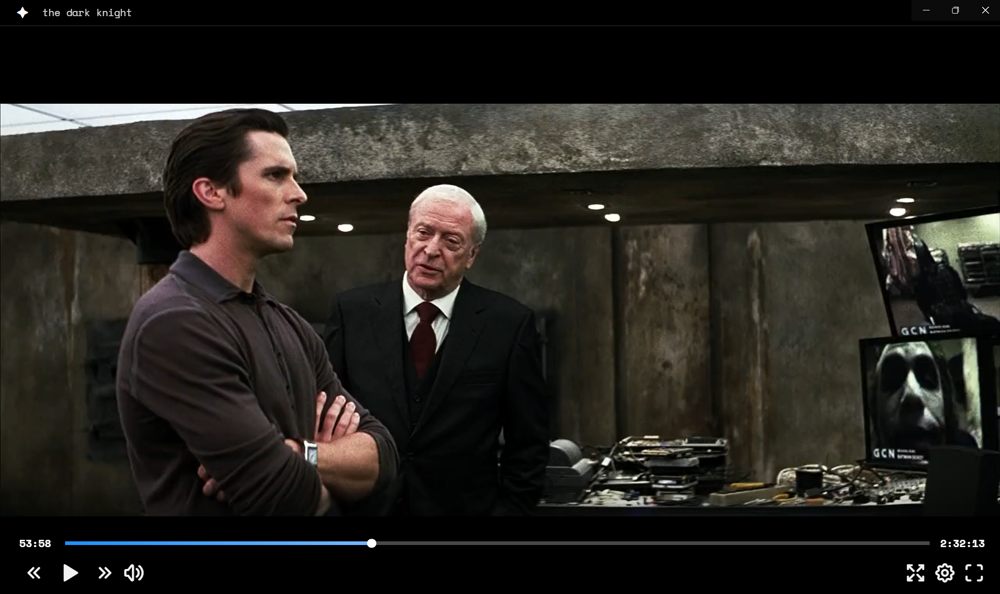

# Luna

A modern, professional video player built with Electron, React, Vite, and Tailwind CSS.



## Tech Stack

- **Electron 28.0.0** - Desktop application framework
- **React 18.3.1** - UI library
- **Vite 4.5.14** - Build tool and dev server
- **Tailwind CSS 3.4.17** - Utility-first CSS framework
- **Tabler Icons** - Modern icon set
- **Space Mono** - Monospace font for professional look

## Features

### Playback Controls
- **Modern UI**: Clean, professional interface with Space Mono font and smooth animations
- **Play/Pause**: Instant playback control with visual feedback
- **Skip Controls**: Jump forward/backward 10 seconds with animated feedback
- **Playback Speed**: Adjustable playback rate from 0.07x to 16x
- **Custom Title Bar**: Draggable title bar with integrated open file button

### Progress & Seeking
- **Interactive Progress Bar**: Click or drag to seek anywhere in the video
- **Video Preview on Hover**: See frame previews when hovering over the progress bar
- **Buffering Indicator**: Visual display of buffered video content
- **Smooth Scrubbing**: Real-time preview while dragging the progress bar
- **Smart Controls**: Controls stay visible during interaction (no auto-hide while scrubbing)

### Audio & Display
- **Volume Control**: Expandable volume slider with mute toggle
- **Visual Feedback**: On-screen icons for mute/unmute, play/pause, and skip actions
- **Fit-to-Screen Toggle**: Switch between contain and cover display modes
- **Fullscreen Support**: Seamless fullscreen experience

### File Handling
- **File Associations**: Automatically opens video files when double-clicked in Windows
- **Drag & Drop**: Drop video files directly onto the player
- **Supported Formats**: MP4, AVI, MKV, MOV, WMV, WebM, M4V, FLV, 3GP, and more
- **Multiple Open Methods**: File menu, keyboard shortcut, or title bar button

### Keyboard Shortcuts
- **Space**: Play/Pause
- **Arrow Left/Right**: Skip backward/forward (10 seconds)
- **F**: Toggle fullscreen
- **M**: Toggle mute
- **Ctrl+O**: Open file

### User Experience
- **Auto-Hide Controls**: Controls fade out during playback (but stay visible during interaction)
- **Responsive Design**: Adapts to different window sizes
- **Smooth Animations**: Polished transitions and visual feedback
- **Settings Menu**: Configure playback rate and preview options

## Installation & Setup

### Prerequisites
- Node.js (version 16 or higher)
- npm (comes with Node.js)

### Development Setup

1. **Install dependencies:**
   ```bash
   npm install
   ```

2. **Run React app in development mode:**
   ```bash
   npm run dev
   ```

3. **Run Electron app in development mode:**
   ```bash
   npm start
   ```

4. **Run both React and Electron in development mode concurrently:**
   ```bash
   npm run dev-all
   ```

### Building for Windows

1. **Build the React app:**
   ```bash
   npm run build
   ```

2. **Build the Windows application:**
   ```bash
   npm run build-win
   ```

3. **Build the Windows application without code signing:**
   ```bash
   npm run build-win-nosign
   ```

4. **The installer will be created in the `release` folder**

### File Associations

Once installed, the app will automatically register file associations for common video formats:
- MP4, AVI, MKV, MOV, WMV, WebM, M4V, FLV, 3GP

You can right-click any video file and select "Open with Luna" or set it as the default application.

## Usage

### Opening Videos
- **File Menu**: Use File → Open Video... or Ctrl+O
- **Drag & Drop**: Drag video files directly onto the player
- **File Association**: Double-click video files in Windows Explorer
- **Open Button**: Click the flare icon in the top-left corner

### Controls
- **Play/Pause**: Click the play button or press Space
- **Skip**: Use the skip buttons or arrow keys (10 seconds)
- **Volume**: Click the volume icon to reveal expandable slider, drag to adjust
- **Progress**: Click or drag anywhere on the progress bar to seek
- **Playback Speed**: Click the settings icon to adjust playback rate (0.07x to 16x)
- **Fullscreen**: Click fullscreen button or press F
- **Fit Mode**: Toggle between contain and cover modes with the maximize icon
- **Video Preview**: Hover over progress bar to see frame preview (can be toggled in settings)

## Development

### Project Structure
```
├── main.js          # Electron main process
├── preload.js       # Electron preload script
├── vite.config.js   # Vite configuration
├── tailwind.config.js # Tailwind CSS configuration
├── src/             # React source files
│   ├── main.jsx     # React entry point
│   ├── App.jsx      # Main App component
│   ├── components/  # React components
│   │   ├── VideoPlayer.jsx # Main video player component
│   │   ├── TitleOverlay.jsx # Title bar component
│   │   ├── ProgressBar.jsx # Progress bar with preview
│   │   ├── VolumeControl.jsx # Volume control
│   │   ├── VideoPreview.jsx # Video preview component
│   │   └── SettingsButton.jsx # Playback settings menu
│   ├── hooks/       # Custom React hooks
│   │   └── useVideoPlayer.js # Video player hook
│   ├── utils/       # Utility functions
│   │   ├── constants.js # Application constants
│   │   ├── fileUtils.js # File handling utilities
│   │   └── videoFeedback.js # Visual feedback utilities
│   ├── styles/      # CSS styles
│   └── assets/      # Icons and resources
├── oldfiles/        # Original vanilla files
├── package.json     # Dependencies and build config
└── dist/            # Build output directory
```

### Customization
- Modify React components in `src/components/` for UI changes
- Update `main.js` for Electron-specific features
- Edit `package.json` for build configuration
- Customize Tailwind CSS in `tailwind.config.js`

## Troubleshooting

### Common Issues
1. **Video won't play**: Check if the video format is supported by Chromium
2. **File associations not working**: Reinstall the application
3. **Performance issues**: Try enabling hardware acceleration in settings

### Supported Video Formats
The player supports all formats that Chromium/Chrome supports natively:
- MP4 (H.264, H.265)
- WebM (VP8, VP9, AV1)
- OGG Theora
- And more depending on system codecs

## License

MIT License - feel free to modify and distribute.